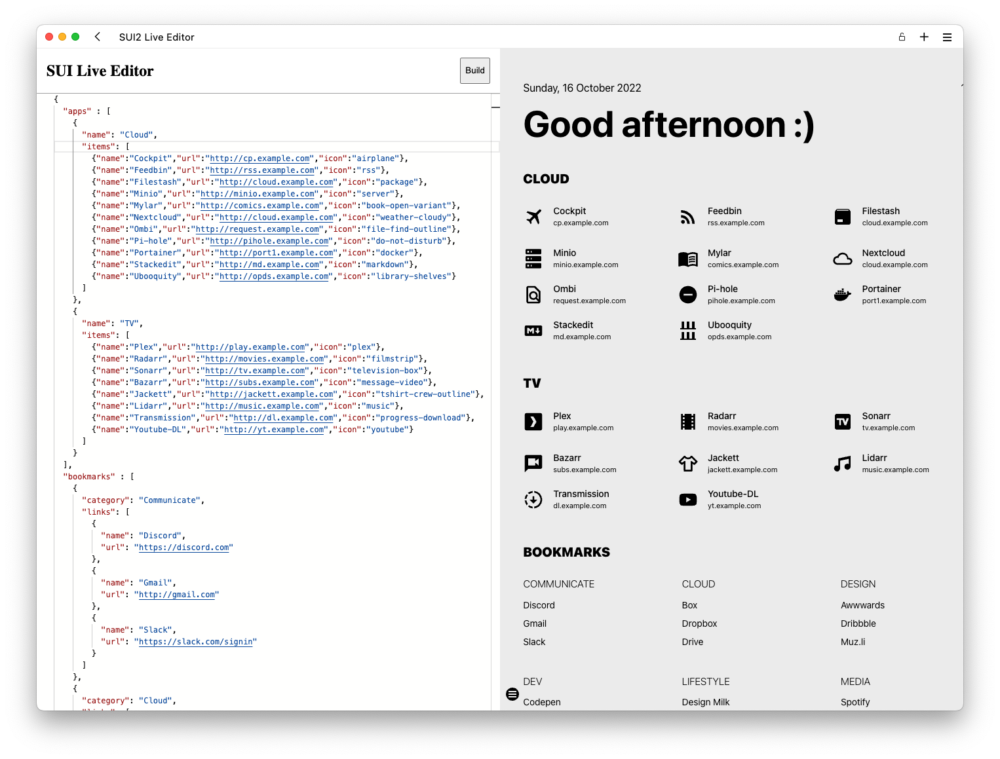

# SUI2

*a startpage for your server and / or new tab page*

Forked from [sui](https://github.com/jeroenpardon/sui), sui2 adds
new features like keyboard navigation and PWA to boost your productivity.
It's a complete refactor, brings new technologies for easier development & deployment.

See how keyboard navigation works in action:

<video src="https://user-images.githubusercontent.com/405972/193420471-7454270e-7bcc-43cc-a61d-e8b65e6b09f3.mov"></video>


## Deploy to any static hosting

sui2 uses Vite to build a staic website, which means it's nothing but vanilla HTML/CSS/JavaScript that could be deployed to anywhere you want.

To build the project, simply follow the steps below.

1. Install dependencies: `npm i`
2. Create you own `data.json`

   sui2 get all the data it requires from `data.json`, you can make a copy from `data.example.json`, and then edit it with your own applications and bookmarks.
3. Build the result: `npm run build`

   The result will be stored in the `dist` folder
4. Upload to a static hosting.

   There are various hosting services like GitHub Pages, Cloudflare Pages, Netlify.
   Examples will be documented later on.

## Deploy using Docker

> Notice: to make the preview page in live editor work more predictable, Docker image does not provide PWA support

sui2 provides a Docker image that runs a NodeJS server,
which not only servers the startpage directly,
but also gives you an interface to edit and build the startpage lively.



The image is hosted on Docker hub at: [reorx/sui2](https://hub.docker.com/r/reorx/sui2)

Run the following command to get started:

```
docker run --rm -t -p 3000:3000 -v data:/data reorx/sui2
```

Command explained:

- `-p 3000:3000`: the server runs on port 3000, you need to specify the port on host to expose, if you want to access it from 5000, you can change the argument to `-p 5000:3000`
- `-v data:/data`: you need to attach a volume to `/data`, which stores the config and static resources of the startpage

After the container is alive, open `http://DOCKER_HOST:3000/` to see the initial startpage.

For the live editor, open `http//DOCKER_HOST:3000/editor/`, there's no link for it on the startpage.

## `data.json` editing

There's a full example in [data.example.json](https://github.com/reorx/sui2/blob/master/data.example.json),
it's self explanatory so I'm not going to write too much about it, maybe a json schema will be created as a supplement in the future.

The only thing worth mentioning here is the `icon` attribute,
it uses the [MDI icon set from Iconify](https://icon-sets.iconify.design/mdi/), you can find any icon you like in this page, and use the name after `mdi:` as the value for the `icon` attribute. For example `mdi:bread-slice` should be used as `"icon": "bread-slice"` in `data.json`.

## TODO

some other features I plan to work in the future, PRs are welcome.

- [ ] Support dynamically render the page from `data.json`. This makes it possible to host a sui2 distribution that is changable without the building tools.
- [ ] A chrome extension that shows sui2 in a popup.
- [ ] Add new tab support for the chrome extension.

## Donation

If you think this project is enjoyable to use, or saves some time,
consider giving me a cup of coffee :)

- [GitHub Sponsors - reorx](https://github.com/sponsors/reorx/)
- [Ko-Fi - reorx](https://ko-fi.com/reorx)
